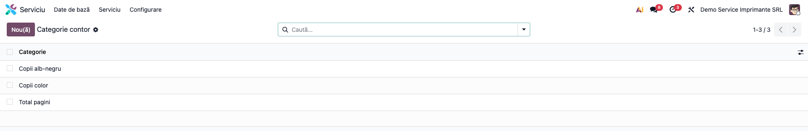
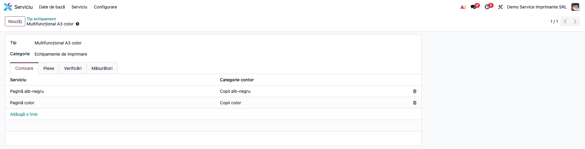
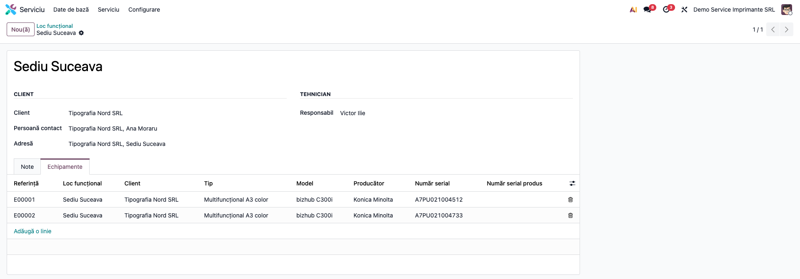
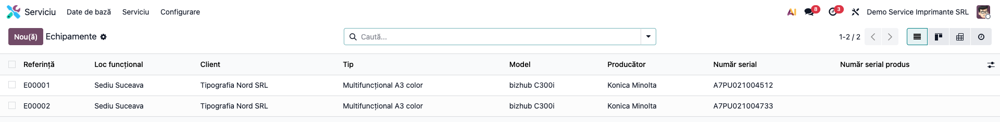
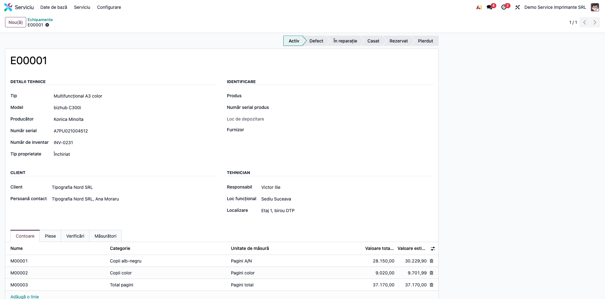
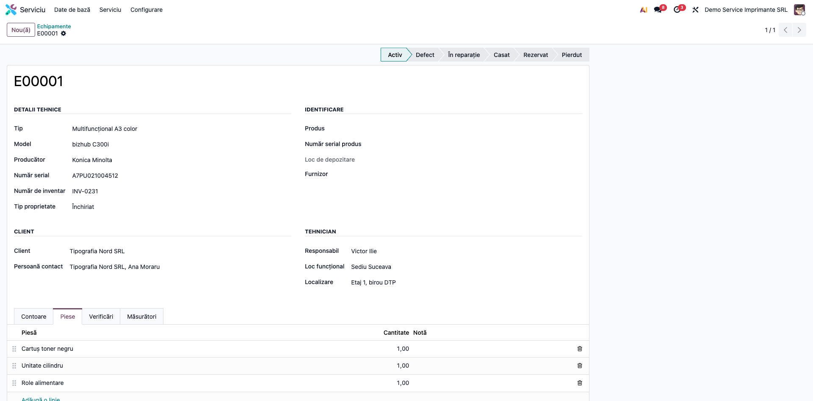
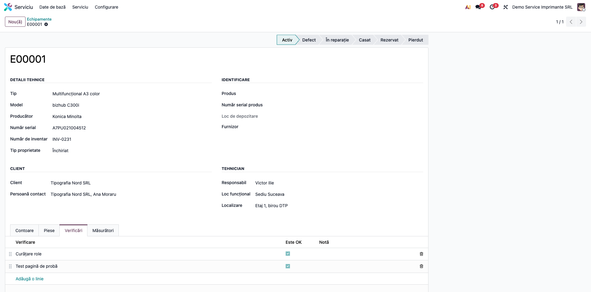
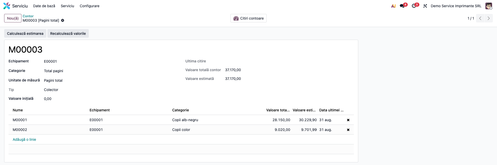
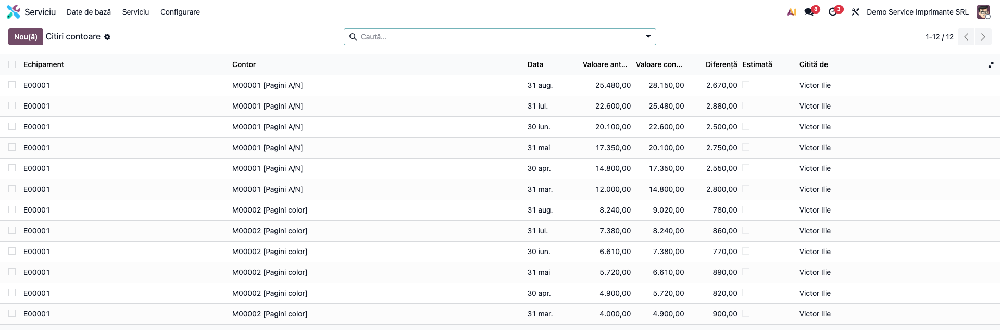
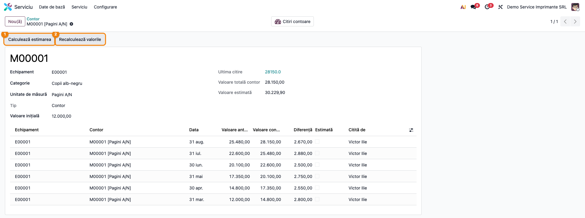

# Fișă Modul: Echipamente de service, contoare și citiri

**Modul:** `deltatech_service_equipment_base`
**Utilizator principal:** Responsabil service / dispecer, tehnician (citiri de contor)
**Prioritate:** 🟡 Medie (nu generează note contabile, dar citirile lui sunt baza facturării pe
consum din modulele de contract ale suitei)

---

## 1. Scop business

O firmă care întreține echipamente la clienți (multifuncționale, imprimante, compresoare,
centrale) are nevoie de un **registru al echipamentelor**: ce echipament, la ce client, unde e
instalat, cine răspunde de el și în ce stare e. Când serviciul se plătește după consum (pagini
tipărite, ore de funcționare), mai are nevoie și de **contoare** și de **citirile** lor.

Modulul este baza suitei de service și aduce:
- **locurile funcționale** — locul de la client unde sunt instalate echipamentele (sediu, punct de
  lucru), cu clientul, persoana de contact, adresa și tehnicianul responsabil;
- **echipamentele** — fișa fiecărui echipament: tip, model, producător, serie, număr de inventar,
  tip de proprietate, client, tehnician, stare (activ, defect, în reparație, casat…);
- **contoarele** echipamentului, fiecare pe o unitate de măsură (ex. pagini alb-negru, pagini
  color), plus **contoare colector** care adună mai multe contoare (ex. total pagini);
- **citirile de contor**, cu diferența față de citirea anterioară și cu o **valoare estimată**
  calculată prin regresie liniară din citirile reale;
- **tipurile de echipament**, cu șabloane de contoare, piese, verificări și măsurători.

**Ce nu face modulul acesta**, deși descrierea tehnică le enumeră: facturarea pe baza citirilor și
introducerea automată la sfârșit de perioadă a citirilor estimate. Acestea se află în modulele
suitei care îl extind (`deltatech_service_equipment`, `deltatech_service_agreement`). Tot acolo
se folosește asistentul **Introducere citiri contoare** și se creează automat contoarele din
șabloanele tipului de echipament.

## 2. Bază legală și context

Modulul nu are bază legală și nu generează note contabile, mișcări de stoc sau documente fiscale.
Câmpul *Număr de inventar* și *Tip proprietate* (proprietate, închiriat, împrumutat) sunt doar
informative: nu creează mijloace fixe și nu leagă echipamentul de contabilitate.

## 3. Utilizatori și roluri

Drepturile vin din grupurile modulului `deltatech_service_base`, secțiunea *Serviciu* din fișa
utilizatorului:

| Rol | Ce face | Drept Odoo |
|---|---|---|
| Responsabil service | configurează tipurile, categoriile, piesele; întreține echipamentele | **Serviciu / Manager** |
| Tehnician / dispecer | creează locuri, echipamente, contoare și citiri | **Serviciu / Utilizator** |
| Alți utilizatori interni | doar consultă echipamentele și contoarele | **Serviciu / Client** (orice utilizator intern are citire) |

Meniul **Configurare** e vizibil doar grupului **Manager**.

**Atenție:** în practică, doar **Manager** poate deschide formularul unui echipament. Piesele,
verificările și măsurătorile echipamentului au drepturi doar pentru acest grup, iar formularul le
afișează în tab-uri. Un **Utilizator** poate crea echipamente, contoare și citiri, dar primește
eroare de acces la deschiderea fișei echipamentului (vezi limitările).

Roluri recomandate la testare: un utilizator **Manager** pentru tot fluxul și un **Utilizator**
pentru citiri.

## 4. Conturi și date implicate

Modulul **nu folosește conturi contabile**. Datele lui:

| Obiect | Rol | Numerotare |
|---|---|---|
| Loc funcțional (`service.location`) | locul de la client unde sunt instalate echipamentele | `E00001`, dacă nu se dă un nume |
| Echipament (`service.equipment`) | fișa echipamentului, cu contoare, piese, verificări, măsurători | `E00001` |
| Contor (`service.meter`) | contor sau colector, pe o unitate de măsură | `M00001` |
| Citire contor (`service.meter.reading`) | valoarea citită la o dată, cu diferența față de citirea anterioară | — |
| Categorie contor, Tip / Model / Categorie echipament, Piese, Verificări, Măsurători | nomenclatoare | — |

Locurile funcționale și echipamentele folosesc **același prefix `E`**, cu numerotări separate:
primul loc și primul echipament sunt ambele `E00001`.

Pe un echipament, **fiecare contor are altă unitate de măsură**: două contoare cu aceeași unitate
pe același echipament sunt refuzate. De aceea contoarele alb-negru și color folosesc unități
separate (ex. „Pagini A/N”, „Pagini color”).

Date demo folosite în capturi: compania **Demo Service Imprimante SRL**, clientul **Tipografia Nord
SRL**, locul funcțional **Sediu Suceava**, două multifuncționale **Konica Minolta bizhub C300i**
(`E00001` activ, `E00002` în reparație). Pe `E00001` sunt contorul alb-negru `M00001` (start
12.000), contorul color `M00002` (start 4.000) și colectorul „Total pagini” `M00003`, cu citiri la
sfârșitul fiecăreia dintre ultimele șase luni:

| Contor | Prima citire | Ultima citire | Consum lunar |
|---|---|---|---|
| M00001 alb-negru | 14.800 | 28.150 | 2.500 – 2.880 |
| M00002 color | 4.900 | 9.020 | 770 – 900 |
| M00003 total (colector) | — | 37.170 = 28.150 + 9.020 | — |

## 5. Configurare inițială

Meniul **Serviciu → Configurare** (doar *Manager*):

1. **Unități de măsură** — pentru fiecare contor al unui echipament e nevoie de o unitate proprie
   (secțiunea 4). Creați-le din *Inventar → Configurare → Unități și ambalaje* (meniul apare
   când e activă opțiunea de unități de măsură), cu unitatea *Unități* ca referință.
2. **Categorie contor** — denumirea, unitatea de măsură și tipul: **Contor** (se citește) sau
   **Colector** (adună alte contoare, nu se citește).



3. **Categorie echipament**, **Model echipament** — nomenclatoare simple.
4. **Piese**, **Verificări**, **Măsurători** — listele din care se aleg piesele, verificările și
   măsurătorile tipurilor de echipament; măsurătorile au și unitate de măsură.
5. **Tip echipament** — denumirea, categoria și patru tab-uri de șabloane: **Contoare** (serviciul
   facturat și categoria de contor), **Piese**, **Verificări**, **Măsurători**.



Alegerea tipului pe un echipament nou îi completează piesele, verificările și măsurătorile din
șabloane. Șabloanele de **contoare** nu creează contoare în acest modul: le folosește
`deltatech_service_equipment`.

## 6. Flux de utilizare

### Pasul 1 — Locul funcțional

*Serviciu → Date de bază → Loc funcțional* → **Nou(ă)**. Completați clientul, persoana de contact,
adresa și tehnicianul (*Responsabil*). Tab-ul **Echipamente** arată echipamentele instalate acolo.



### Pasul 2 — Echipamentul

*Serviciu → Date de bază → Echipament* → **Nou(ă)**.



În formular:
- **Detalii tehnice**: *Tip* (completează piesele, verificările și măsurătorile), *Model*,
  *Producător*, *Număr serial*, *Număr de inventar*, *Tip proprietate*;
- **Identificare**: *Produs* stocabil și *Număr serial produs* (lotul / seria din stoc). Cu ambele
  completate, butonul **Trasabilitate** arată mișcările de stoc ale seriei, iar *Loc de depozitare*
  arată unde se află seria;
- **Client** și **Tehnician**: alegerea *Locului funcțional* completează clientul, persoana de
  contact și responsabilul. *Localizare* e un text liber (ex. „Etaj 1, birou DTP”);
- **Starea** se alege din bara de stare: *Activ, Defect, În reparație, Casat, Rezervat, Pierdut*.
  Un echipament nou nu are nicio stare; alegeți-o la creare.

Tab-ul **Contoare** conține contoarele echipamentului, cu valoarea totală și valoarea estimată.



Tab-urile **Piese**, **Verificări** și **Măsurători** țin lista pieselor (cu cantitate), a
verificărilor (cu bifa *Este OK*) și a măsurătorilor (cu valoare și unitate).





### Pasul 3 — Contoarele

Din tab-ul *Contoare* al echipamentului sau din *Serviciu → Date de bază → Contor*: alegeți
**Categoria** (unitatea de măsură se completează din ea) și, pentru un contor, **Valoarea
inițială** — indexul de la punerea în funcțiune. Codul `M00001` se dă automat.

Un **colector** nu se citește: în formularul lui alegeți contoarele pe care le adună. *Valoarea
totală* a colectorului este suma ultimelor citiri ale acestora.



Adăugați contoarele într-un colector **doar după ce au cel puțin o citire** (vezi limitările).

### Pasul 4 — Citirile

*Serviciu → Serviciu → Citiri contoare* → **Nou(ă)**, sau butonul **Citiri contoare** din formularul
contorului (echipamentul și contorul se completează). Completați *Data*, *Valoare contor* și
*Citită de*. *Valoare anterioară* și *Diferență* se calculează din citirea precedentă (sau din
*Valoarea inițială*, la prima citire). *Estimată* marchează o valoare neciteită efectiv.



Introduceți citirile **în ordine cronologică**. O citire cu dată între două citiri existente nu
actualizează citirea următoare, care rămâne cu diferența veche. Consumul pe perioadă iese astfel
umflat. După o asemenea citire, apăsați **Recalculează valorile** pe contor.

### Pasul 5 — Estimarea și recalcularea

În formularul contorului:
- **Calculează estimarea** ① calculează coeficienții dreptei de regresie din citirile reale
  (nebifate *Estimată*). *Valoare estimată* arată apoi valoarea prognozată pentru ziua curentă.
  Până la prima apăsare, valoarea estimată e egală cu ultima citire;
- **Recalculează valorile** ② refac, în ordinea datelor, *Valoarea anterioară* și *Diferența*
  tuturor citirilor contorului.



Coeficienții se recalculează singuri doar la **modificarea datei** unei citiri. La o citire nouă nu
se recalculează. Apăsați **Calculează estimarea** după fiecare serie de citiri, înainte de a folosi
valorile estimate (de exemplu în asistentul de citiri din `deltatech_service_equipment`).

## 7. Legături cu alte module / declarații

- **`deltatech_service_base`** (dependență) — meniul *Serviciu*, grupurile *Client / Utilizator /
  Manager*, ciclurile și perioadele de service.
- **`stock`**, **`product`** (dependențe) — produsul și seria echipamentului, mișcările de stoc ale
  seriei (*Trasabilitate*).
- **`deltatech_service_equipment`** — extinde modulul: creează contoarele din șabloanele tipului,
  aduce asistentul **Introducere citiri contoare** (propune valoarea estimată la data aleasă și
  avertizează când valoarea e mai mică decât ultima citire sau există citiri ulterioare) și leagă
  echipamentele de contractele de service și de facturare.
- **`deltatech_service_consumable`** — raportul de eficiență al consumabilelor folosește consumul pe
  perioadă al contoarelor, calculat ca sumă a diferențelor citirilor.
- Nu are legături contabile și nu influențează nicio declarație ANAF.

## 8. Verificări pentru consultant

- [ ] Utilizatorii care deschid fișele echipamentelor au grupul **Serviciu / Manager** (vezi
      limitările).
- [ ] Fiecare contor al unui echipament are altă unitate de măsură.
- [ ] Alegerea *Tipului* pe un echipament nou îi completează piesele, verificările și măsurătorile.
- [ ] Alegerea *Locului funcțional* completează clientul, contactul și responsabilul.
- [ ] Prima citire are *Valoare anterioară* = *Valoarea inițială* a contorului; pe demo, M00001:
      12.000 → 14.800, diferență 2.800.
- [ ] *Valoare totală contor* = ultima citire (28.150 pe M00001), iar colectorul M00003 arată
      37.170.
- [ ] După **Calculează estimarea**, *Valoare estimată* depășește ultima citire (pe demo, M00001:
      30.229,90 la data generării capturilor).
- [ ] O citire cu dată intercalată, urmată de **Recalculează valorile**, dă diferențe corecte pe
      toate citirile.

## 9. Mesaje de eroare frecvente

| Mesaj / simptom | Cauză probabilă | Remediere |
|---|---|---|
| Eroare de acces la deschiderea unui echipament, pentru un *Utilizator* de service | Piesele, verificările și măsurătorile echipamentului au drepturi doar pentru *Manager* | Dați grupul **Serviciu / Manager** celor care lucrează pe fișa echipamentului |
| Eroare de unicitate la salvarea unui contor („duplicate key … service_meter_equipment_uom_uniq”) | Echipamentul are deja un contor cu aceeași unitate de măsură | Folosiți o unitate de măsură proprie contorului (secțiunea 4) |
| „tuple index out of range” la salvarea sau deschiderea unui colector | Unul dintre contoarele adunate nu are încă nicio citire | Introduceți întâi o citire pe fiecare contor, apoi adăugați-l în colector |
| Consum lunar prea mare după o citire introdusă cu dată în trecut | Citirea următoare a rămas cu valoarea anterioară veche | **Recalculează valorile** pe contor |
| *Valoare estimată* egală cu ultima citire | Coeficienții de estimare nu au fost calculați | **Calculează estimarea** pe contor |
| Meniul *Configurare* lipsește | Utilizatorul nu are grupul *Manager* | Comportament voit |

## 10. Capturi de ecran

Capturile (`readme/screenshots/`) se generează automat din `tests/test_screenshots.py`, cu mixinul
`ScreenshotCase` din `l10n_ro_doc_screenshots` (import defensiv). Sunt în **limba română**, pe
compania **Demo Service Imprimante SRL**, cu datele demo din secțiunea 4.

| # | Fișier | Conținut |
|---|---|---|
| 1 | `01_categorii_contoare.png` | Categoriile de contoare: alb-negru, color, total (colector) |
| 2 | `02_tip_echipament.png` | Tipul „Multifuncțional A3 color”, cu șabloanele lui |
| 3 | `03_loc_functional.png` | Locul funcțional, cu tab-ul *Echipamente* |
| 4 | `04_echipamente.png` | Lista echipamentelor |
| 5 | `05_echipament_contoare.png` | Fișa echipamentului, tab-ul *Contoare* |
| 6 | `06_echipament_piese.png` | Tab-ul *Piese* |
| 7 | `07_echipament_verificari.png` | Tab-ul *Verificări* |
| 8 | `08_contor_citiri.png` | Contorul alb-negru, cu citirile și butoanele de calcul |
| 9 | `09_contor_colector.png` | Colectorul „Total pagini” |
| 10 | `10_citiri_contoare.png` | Lista citirilor |

Regenerare:

```bash
./odoo/odoo-bin -c odoo.conf -d <db> -i deltatech_service_equipment_base,l10n_ro,l10n_ro_doc_screenshots \
    --test-tags=/deltatech_service_equipment_base:TestServiceEquipmentScreenshots --stop-after-init \
    --http-port=8993 --gevent-port=8994
```

## 11. Observații pentru manual

Păstrați ordinea de lucru:
1. grupurile (*Manager* pentru cine lucrează pe fișele echipamentelor);
2. unitățile de măsură și categoriile de contoare;
3. piesele, verificările, măsurătorile și tipurile de echipament;
4. locurile funcționale ale clientului;
5. echipamentele, cu starea lor;
6. contoarele, cu valoarea inițială, apoi colectoarele;
7. citirile, în ordine cronologică;
8. **Calculează estimarea** după fiecare serie de citiri.

Subliniați că **valoarea inițială** a contorului e indexul de la punerea în funcțiune: din ea se
calculează consumul primei luni.

### Limitări cunoscute

- **Doar „Manager” poate deschide fișa echipamentului**: piesele, verificările și măsurătorile au
  drepturi numai pentru acest grup, iar formularul le încarcă. *Utilizator* și *Client* primesc
  eroare de acces.
- **O citire cu dată în trecut nu actualizează citirea următoare**, care își păstrează valoarea
  anterioară și diferența veche. Consumul pe perioadă iese umflat (pe un exemplu verificat: 1.400
  în loc de 1.100) până la **Recalculează valorile**.
- **Estimarea nu se recalculează la o citire nouă**, doar la modificarea datei unei citiri sau la
  **Calculează estimarea**.
- **Un colector care adună un contor fără citiri dă eroare** („tuple index out of range”).
- **Locurile funcționale și echipamentele au același prefix de numerotare** (`E`).
- **Un echipament nou nu are stare**: bara de stare pornește goală.
- **Șabloanele de contoare ale tipului** nu creează contoare în acest modul; creează
  `deltatech_service_equipment`.
- **Asistentul „Introducere citiri contoare”** e definit aici, dar nu are niciun buton sau meniu în
  acest modul; îl deschide `deltatech_service_equipment`.
